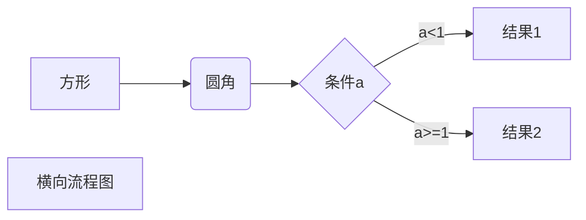
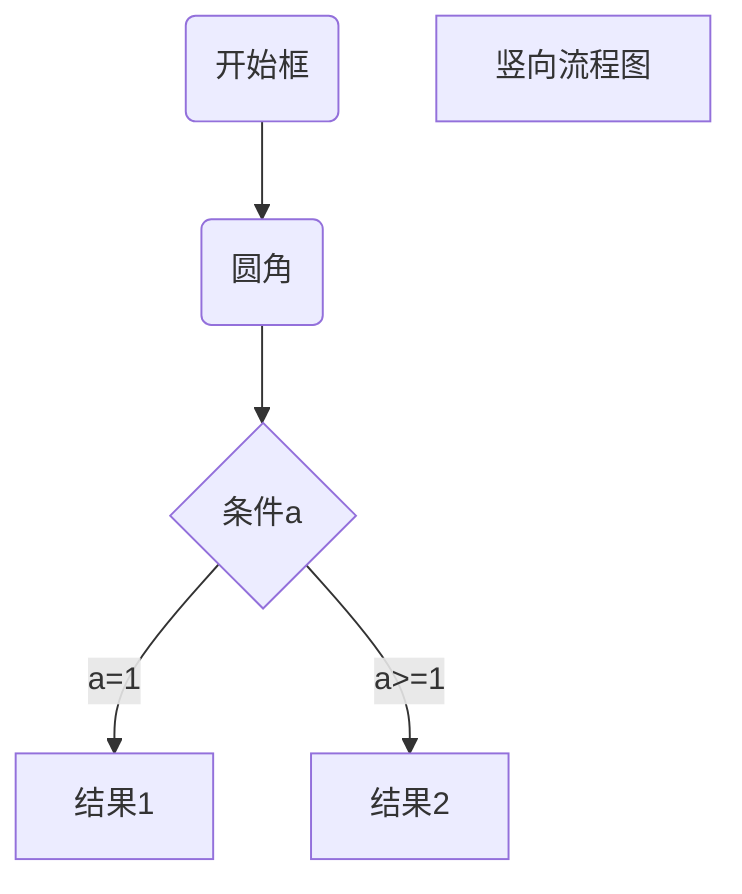

# <a name="锚点1">目录</a>

1. Markdown 是什么？
2. 为什么要使用Markdown?
3. Markdown怎么使用？
4. Markdown 都有哪些人在用？
5. 尝试一下Markdown的使用！
6. Markdown 进阶语法！
<!--more-->

# 学习目标

通过学习，能对Markdown语法有个比较全面的认知，对日常工作写作排版尽量放弃Word、txt等文本工具，改直接用Markdown语言写文档。

# 学习思路

1. 开始先记住 # 这是标题  ## 这二级标题 ### 这是三级标题

2. 然后可以记住用 1. 第一点、- 第一点 做列表超级方便

3. 写作的正文总要加重点吧，**加粗** 、*斜体*、~~删除线~~就开始派上用场了

4. 如果需要写代码或者命令的话 
    `\`这是单行代码\``

    \t这是多行代码
    int i;
    
5. 其他

# 正文
## Markdown是什么？


| 互联网媒体类型 | `text/markdown`                                              |
| -------------- | ------------------------------------------------------------ |
| 统一类型标识   | `net.daringfireball.markdown`                                |
| 开发者         | [John Gruber](https://zh.wikipedia.org/wiki/John_Gruber) (in collaboration with [Aaron Swartz](https://zh.wikipedia.org/wiki/Aaron_Swartz) on the syntax) |
| 初始版本       | 2004年3月19日（15年前）                                      |
| 最新版本       | 1.0.1 (2004年12月17日（14年前)                               |
| 格式类型       | [Markup language](https://zh.wikipedia.org/w/index.php?title=Markup_language&action=edit&redlink=1) |
| 延伸成         | [MultiMarkdown](https://zh.wikipedia.org/w/index.php?title=MultiMarkdown&action=edit&redlink=1), [Markdown Extra](https://zh.wikipedia.org/w/index.php?title=Markdown_Extra&action=edit&redlink=1), [CommonMark](https://zh.wikipedia.org/w/index.php?title=CommonMark&action=edit&redlink=1) |
| 自由格式       | yes                                                          |
| 网站           | [daringfireball.net/projects/markdown](https://daringfireball.net/projects/markdown) |


Markdwon 是一种轻量级 **标记语言**，它以纯文本形式（易读、易写、易更改）编写文档，并最终以HTLM格式发布。Markdown也可以理解为将以 MARKDOWN语法编写的语言转换成HTML内容的工具。[维基百科](https://zh.wikipedia.org/wiki/Markdown) | [百度百科](https://baike.baidu.com/item/markdown/3245829?fr=aladdin)
## 为什么要使用Markdown?
- 它是易读（看起来舒服）、易写（语法简单）、易更改（纯文本）。处处体现着极简主义的影子。
- 兼容HTML,可以转换为HTML格式发布。
- 跨平台使用。
- 越来越多的网站支持Markdown.
- 摆脱Word,txt！
## Markdown怎么使用？
Markdown语法分为如下几大部分：
- 标题
- 段落
- 区块引用
-  代码区块
-  强调
-  列表
-  分割线
-  链接
-  图片
-  反斜杠
-  符号
-  表格
-  流程图
### 标题
两种形式
1. 使用 = 和 - ，标记**遗迹**和**二级**标题
示例代码(**注意"="和"-"数量至少大于2个**)
```
一级标题
==
二级标题 
--
```
示例效果：

一级标题
==
二级标题
--

2. 使用 # 可以表示 1-6 级标题
示例md代码：
**注意 # 后面要加一个空格，你可以选择性地「闭合」类 atx 样式的标题，这纯粹只是美观用的，若是觉得这样看起来比较舒适，你就可以在行尾加上 #，而行尾的 # 数量也不用和开头一样（行首的井字符数量决定标题的阶数**
```
  # 第一级标题 #
  ## 第二级标题 
  ### 第三级标题
  #### 第四级标题
  ##### 第五级标题
  ###### 第六级标题
```
示例效果：
# 第一级标题 
## 第二级标题
### 第三级标题
#### 第四级标题
##### 第五级标题
###### 第六级标题


### 段落


###  区块引用
在段落的每行或者只在第一行使用符号 > ,还可使用多个嵌套引用，如
```
> 区块引用
> > 嵌套引用
> > >三嵌套引用
> > > > 四嵌套引用
```
示例效果：
>区块引用 第一行
>区块引用 第二行

>区块引用
>>嵌套引用
>>>三嵌套引用
>>>
>>>>四嵌套引用

### 代码区块
1. 用反引号来控制```  ```` ，或者在预览页面鼠标右键，会在窗口中弹出一个子窗口，选择：插入—代码块；
2. 在第一个反引号```后输入javascript,或者在预览页面点击右下角的“select  a language” ，在其中输入“javascript并选择，点击确认则会为代码块中代码添加颜色（按照javascript代码的上色规则）；
示例效果：
```javascript
var myDate = new Date();
var year = myDate.getFullYear();
var month = myDate.getMonth() + 1;
var day = myDate.getDate();
var now = year + "-" + month + "-" + day;

var yarrs = date1[0].value.split("-");
var ytime = new Date(yarrs[0], yarrs[1], yarrs[2]);
var ytimes = ytime.getTime();

var arrs = now.split("-");
var lktime = new Date(arrs[0], arrs[1], arrs[2]);
var lktimes = lktime.getTime();

if (ytimes > lktimes) {
    alert("请加完班再填写实际加班信息！");
    return false;
}
```

### 强调

在强调内容两侧分别加上 `*` 或者`_`    

示例代码：

```
**粗体**		//左右各一个 **
__粗体__		//左右各一个 __  (左右各两个"_")
*斜体*		//左右各一个 *
_斜体_		//左右各一个 _

```

示例效果：

**粗体**

__粗体__

*斜体*

_斜体_


### 列表（有序，无序）

#### 无序列表

使用`-`、`+`或者`*`

```
- 第一项
- 第二项
+ 第三项
* 第四项
```

示例效果：

- 第一项
- 第二项

+ 第三项

* 第四项

#### 有序列表

```
1. 第一项
2. 第二项
3. 第三项
4. 第四项
```

示例效果：

1. 第一项
2. 第二项
3. 第三项
4. 第四项


### 分割线

分割线最常使用就是三个或以上的 `*` ， `---` `___`

示例代码：

```javscript
***
---
___

```

***

___

---


### 链接

链接可以由两种形式生成，**行内式** 和 **参考式**。

**行内式**

示例代码：

```
[GitHub](http://github.com)
<http://github.com>
```

示例效果：

[GitHub](http://github.com)

<http://github.com>

**参考式**

示例代码：

```
[GitHub][1]
[1]:http://github.com
```

[GitHub][1]

[1]: http://github.com

**注意：**上述的 [1]:http://github.com不出现在区块中。

### 图片

添加图片形式和链接相似，只需要在链接的基础上前方加一个 **！**号


### 反斜杠 `\`

相当于**反转义**作用。使符号成为普通符号。比如

```
*iteral asterisks*       //设置斜体
\*literal asterisks\*    //使用反斜杆使 * 变成 正常的 * 
```

*iteralasterisks*

\*literal asterisks\*

Markdown 支持以下这些符号前面加上反斜杠来帮助插入普通的符号：

```
\   反斜线
`   反引号
*   星号
_   底线
{}  花括号
[]  方括号
()  括弧
#   井字号
+   加号
-   减号
.   英文句点
!   惊叹号
```


 ### 符号 ``

`Ctrl+A`   

`Ctrl+C`


### 表格

示例代码：

```
序号 | 日期 | 假别 | 标准上下班时间 | 时间起 | 时间止 | 时数
---|------|--------|---------|---------|-----|------
1 | 2019-03-04| 年假 | 08:00-17:00|08:00|17:00|8
2 |2019-03-05|年假|08:00-17:00|08:00|17:00|8
```
序号 | 日期 | 假别 | 标准上下班时间 | 时间起 | 时间止 | 时数
-----|------|--------|---------|---------|-----|------
1 | 2019-03-04| 年假 | 08:00-17:00|08:00|17:00|8
2 |2019-03-05|年假|08:00-17:00|08:00|17:00|8


### 流程图

横向流程图源码格式：

```
​```mermaid

graph LR

A[方形] -->B(圆角)

    B --> C{条件a}

    C -->|a=1| D[结果1]

    C -->|a=2| E[结果2]

    F[横向流程图]

​```
```




竖向流程图源码格式：

```
​```mermaid

graph TD

A[方形] -->B(圆角)

    B --> C{条件a}

    C -->|a=1| D[结果1]

    C -->|a=2| E[结果2]

    F[竖向流程图]

​```
```




### Markdown锚点

```
#####<a href="#第一段的锚点名称">第一段标题</a>
####<a name="第一段的锚点名称">第一段标题</a>
```

<a href="#锚点1">回到目录</a>

## Markdown都哪些人在用？

Markdown 的使用作者：

* Github
* 简书
* CSDN
* StackOverFlow
* 等等

## 尝试一下Markdown的使用

* **typora**（本文档就是typora编辑的）
* notepad++ :需要下载插件
* 等等


[1]:https://i.loli.net/2019/03/04/5c7cab451fd26.jpg
[2]:https://i.loli.net/2019/03/04/5c7cb1fa9adc1.jpg
